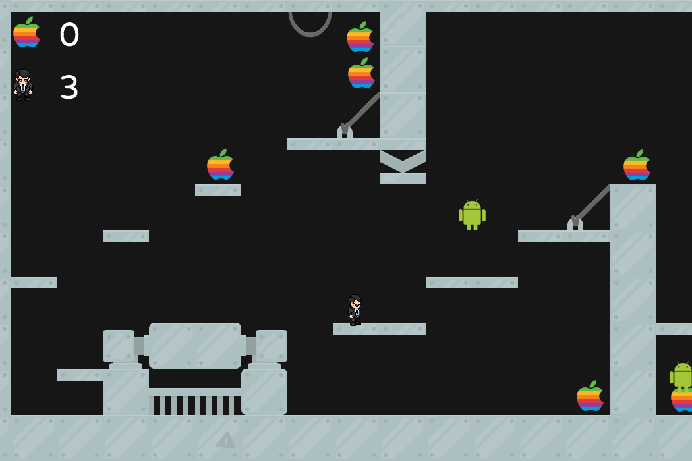
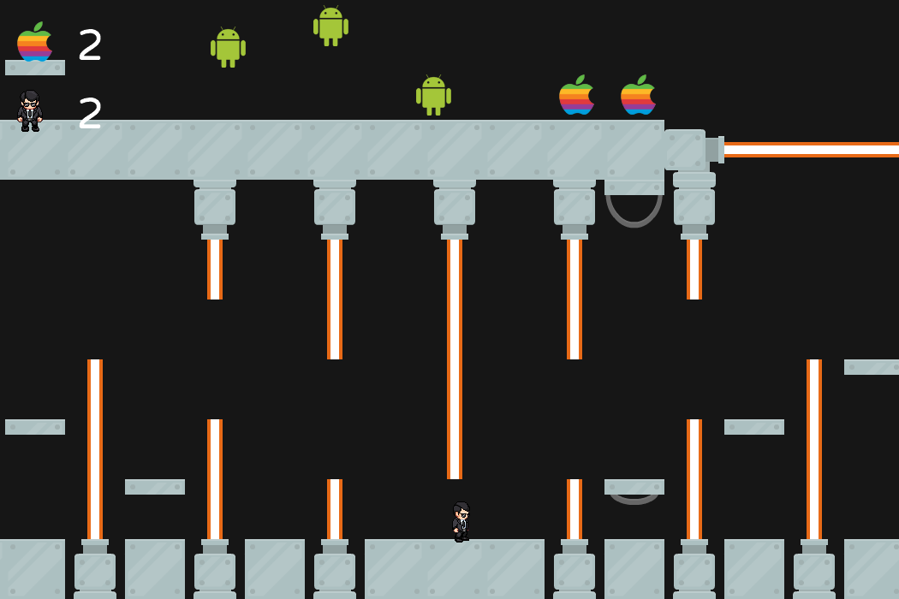
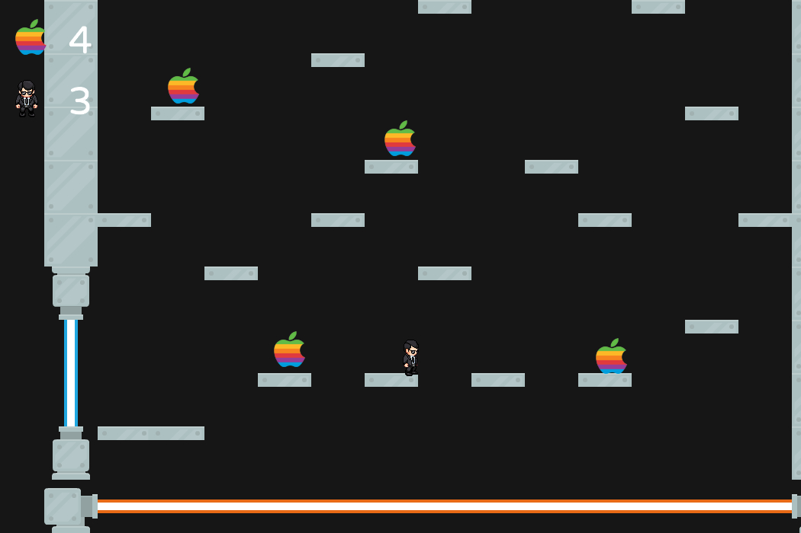

# MyFirstFXMLGame
Bunden_Forudsætning_Spiludvikling

Dette repository indeholder resultatet af udviklingen henimod mit første mini-spil programmeret i **Java** baseret på **FXGL-biblioteket (version 0.4.2).** Inspiration og tutorials er hentet fra [**AlmasB**](http://almasb.github.io/FXGL/).

Selve kildekoden kan findes i mappen **"src"**, og spillet kan eksekveres via **jar-filen** - _Husk du skal have **JDK 9** installeret!_ Det er ikke muligt at clone repo direkte til sit **IDEA** og få det til at køre, da jeg har undladt at uploade visse filer og mapper.

Læs mere om **FXGL** og processen henimod det færdige spil i [**Wiki-sektionen**](https://github.com/SebastianOugterOlsen/MyFirstFXMLGame/wiki) og se evt. projektets [**GH Page**](https://sebastianougterolsen.github.io/MyFirstFXMLGame/) for en mere visuel præsentation.

## Screenshots

## Spilinstruktioner

Spillet hedder **An APPLE guy's adventure**, og går i alt sin enkelthed ud på at samle alle æblerne gennem de 3 levels, uden at ramme de sindsforstyrredes form for styresystem (Android) og ej heller blive grillet af de røde laisere. 
Du styrer din _player_ med piletasterne **VENSTRE, HØJRE & OP**  
Oppe i venstre hjørne af spilvinduet kan du se, hvor mange æbler du har samlet og hvor mange liv du har tilbage. Hvis du løber tør for liv starter spillet forfra fra lvl1.

Spillet kan desuden pauses på **Esc**, og du kan tage screenshot in-game på **P**.

## Informationer & Credits

- Udviklet af **Sebastian Ougter Olsen** // hhttps://github.com/SebastianOugterOlsen
- Datamatiker, 2. semester, 2018, **EASJ Sjælland** // http://easj.dk
- Inspiration fra **AlmasB** // https://github.com/AlmasB
